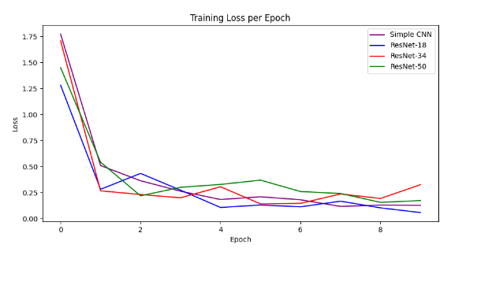
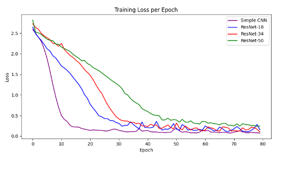
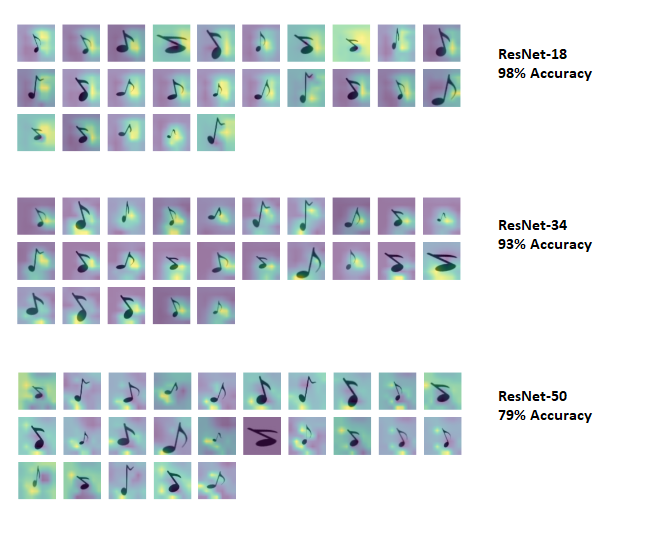

# CNN-ResNet-Analysis

This project focuses on analysis of Residual Neural Network (ResNet) models using PyTorch.

## Table of Contents

- [Introduction](#introduction)
- [Models](#models)
- [Results](#results)
- [Dependencies](#dependencies)

## Introduction
This project explores ResNet models using PyTorch and Grad-CAM (Gradient-weighted Class Activation Mapping) for visualization. ResNet fixes the vanishing gradient problem by introducing skip connections, enabling the training of deep neural networks. Grad-CAM is a technique used to visualize the regions of an image that are important for predicting a specific class, providing insights into model decision-making.

## Models
Analysis includes different implementations ResNet models:
- ResNet-18: ResNet architecture with 18 layers, consisting of residual blocks.
- ResNet-34: ResNet architecture with 34 layers, featuring deeper networks.
- ResNet-50: ResNet architecture with 50 layers, consisting of bottleneck blocks.
- Simple CNN: A basic CNN architecture with three convolutional layers followed by fully connected layers, serving as a dummy for comparison.  

These models are trained and evaluated to analyze their performance and behavior on different datasets.

## Results
Deeper ResNet versions have a tendency to overfit more on smaller datasets compared to simpler CNN architectures. However, on substantially large and complex datasets, shallower architectures may also lead to overfitting, while deeper ResNets demonstrate better accuracy.  

  <figure>
    <figcaption>Small dataset - ResNet variations overfitting</figcaption>
    
  </figure>
  
  <figure>
    <figcaption>Large dataset - ResNet-50 does the best</figcaption>
    
  </figure>

Using the Grad-CAM in the ResNet, decision making process was visualized, highlighting the regions of input images crucial for predicting specific classes. These visualizations provide valuable insights into how the model understands data.  

  <figcaption>Grad-CAM on small dataset</figcaption>
  

## Dependencies
- PyTorch (CUDA)
- OpenCV (cv2)
- NumPy
- Matplotlib
